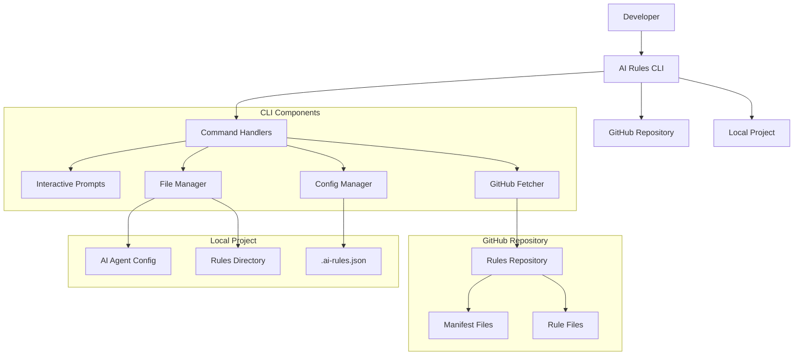
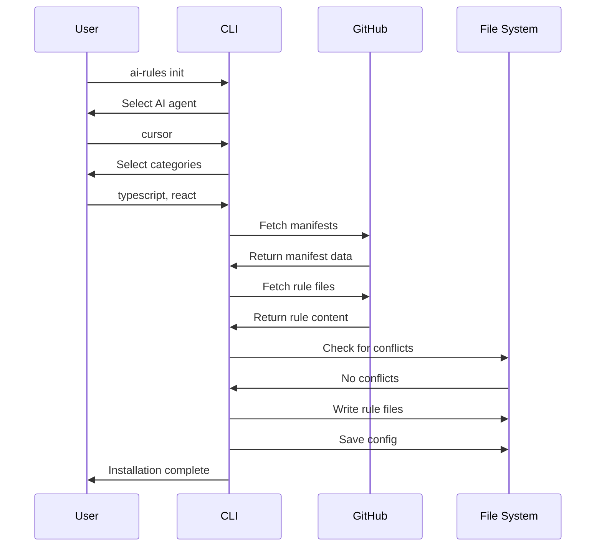
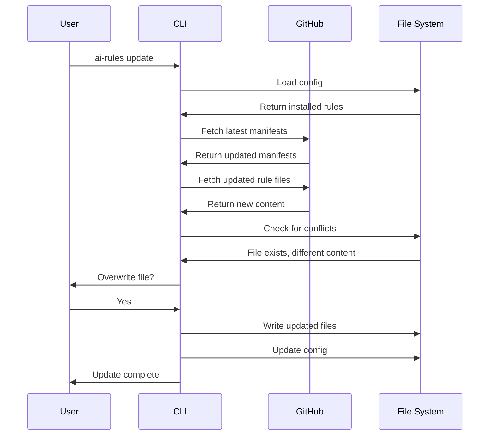

# System Design Document

## Overview

AI Rules CLI is a command-line tool that fetches curated AI agent rules from a GitHub repository and installs them into developer projects. The system is designed to be simple, extensible, and focused on developer experience.

## Architecture Diagram



## Core Components

### 1. Command Handler (`commands/`)

Responsible for parsing CLI arguments and delegating to appropriate handlers.

**Key Commands:**

- `init` - Interactive setup wizard
- `add` - Add specific rule categories
- `remove` - Remove rule categories
- `update` - Update to latest rules
- `list` - Show available categories
- `status` - Show installed rules
- `search` - Semantic search (future)

### 2. Interactive Prompts (`lib/prompts.ts`)

Handles all user interactions using Inquirer.js.

**Prompt Types:**

- AI agent selection
- Category multi-select
- Conflict resolution
- Refinement questions (future)

### 3. GitHub Fetcher (`lib/github.ts`)

Fetches rule files and manifests from the GitHub repository.

**Responsibilities:**

- Fetch manifest files to discover available rules
- Download rule files based on selections
- Handle GitHub API rate limiting
- Cache responses for performance

### 4. File Manager (`lib/files.ts`)

Manages local file operations and conflict detection.

**Responsibilities:**

- Write rule files to appropriate locations
- Detect file conflicts
- Handle different AI agent conventions
- Create necessary directories

### 5. Config Manager (`lib/config.ts`)

Manages the `.ai-rules.json` configuration file.

**Responsibilities:**

- Save/load project configuration
- Track installed rules
- Store user preferences
- Handle config migrations

## Data Flow

### 1. Initialization Flow



### 2. Update Flow



## GitHub Repository Structure

```
/rules
  /cursor
    /typescript
      manifest.json
      rules.md
      README.md
    /react
      manifest.json
      react-server-components.md
      react-hooks.md
      README.md
    /nextjs
      manifest.json
      app-router.md
      pages-router.md
      README.md
  /windsurf
    /typescript
      manifest.json
      rules.md
      README.md
    /react
      manifest.json
      rules.md
      README.md
  README.md
```

## Error Handling

### Network Errors

- **GitHub API failures**: Retry with exponential backoff
- **Network timeouts**: Clear error message with retry option
- **Rate limiting**: Inform user and suggest waiting

### File System Errors

- **Permission denied**: Check file permissions and suggest fixes
- **Disk space**: Warn user about insufficient space
- **Path conflicts**: Offer alternative locations

### Configuration Errors

- **Invalid JSON**: Backup and recreate config file
- **Missing fields**: Provide defaults and migrate
- **Version mismatches**: Handle config schema evolution

## Extensibility Points

### 1. Adding New AI Agents

1. Create agent-specific folder in `/rules`
2. Define file naming conventions
3. Update CLI prompts to include new agent
4. Add agent-specific file handling logic

### 2. Adding New Rule Categories

1. Create category folder with manifest
2. Add rule files with proper metadata
3. Update category discovery logic
4. Test with CLI commands

### 3. Adding New Commands

1. Create command handler in `/commands`
2. Register with Commander.js
3. Add help documentation
4. Update CLI tests

## Performance Considerations

### Caching Strategy

- **Manifest caching**: Cache manifests for 1 hour
- **Rule file caching**: Cache rule files for 24 hours
- **Config caching**: Load config once per command

### Memory Usage

- **Streaming**: Stream large files instead of loading into memory
- **Lazy loading**: Only load manifests when needed
- **Cleanup**: Clear caches after operations

### Network Optimization

- **Parallel requests**: Fetch multiple files simultaneously
- **Compression**: Use GitHub's gzip compression
- **Conditional requests**: Use ETags for cache validation

## Security Considerations

### Input Validation

- **File paths**: Sanitize all file paths to prevent directory traversal
- **GitHub URLs**: Validate repository URLs and file paths
- **User input**: Validate all user-provided data

### File System Safety

- **Path resolution**: Resolve all paths relative to project root
- **Backup creation**: Create backups before overwriting files
- **Permission checks**: Verify write permissions before operations

### Network Security

- **HTTPS only**: All GitHub requests use HTTPS
- **Certificate validation**: Verify SSL certificates
- **Rate limiting**: Respect GitHub API rate limits

## Monitoring and Observability

### Logging

- **Command execution**: Log all commands with parameters
- **File operations**: Log file reads/writes with paths
- **Network requests**: Log GitHub API calls with status codes
- **Errors**: Log all errors with stack traces

### Metrics

- **Command usage**: Track most used commands
- **Rule popularity**: Track most installed rule categories
- **Error rates**: Monitor error frequency by type
- **Performance**: Track command execution times

### Debugging

- **Verbose mode**: `--verbose` flag for detailed logging
- **Dry run**: `--dry-run` flag to preview operations
- **Debug config**: `--debug` flag for development debugging

## Future Enhancements

### Vector Database Integration

- **Embedding generation**: Create embeddings for rule content
- **Semantic search**: Enable natural language rule discovery
- **Similarity matching**: Find related rules automatically

### Machine Learning

- **Usage patterns**: Learn from user behavior
- **Rule recommendations**: Suggest relevant rules
- **Conflict resolution**: Automatically resolve simple conflicts

### Community Features

- **Rule ratings**: Allow users to rate rule quality
- **Custom rules**: Support for user-defined rules
- **Rule sharing**: Share rule combinations with others

## Dependencies

### Core Dependencies

- **commander**: CLI argument parsing
- **inquirer**: Interactive prompts
- **chalk**: Terminal styling
- **node-fetch**: HTTP requests

### Development Dependencies

- **typescript**: Type checking and compilation
- **@types/node**: Node.js type definitions
- **jest**: Testing framework
- **eslint**: Code linting

### Optional Dependencies (Future)

- **@pinecone-database/pinecone**: Vector database
- **openai**: Embedding generation
- **lancedb**: Local vector database
