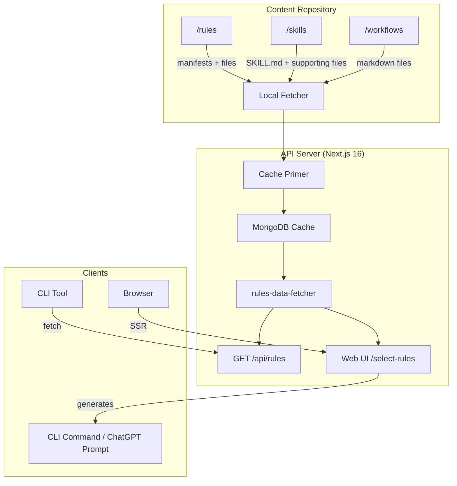
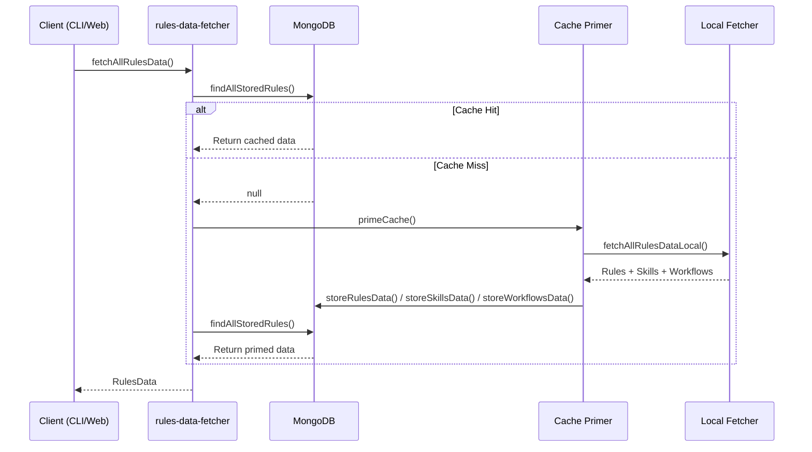
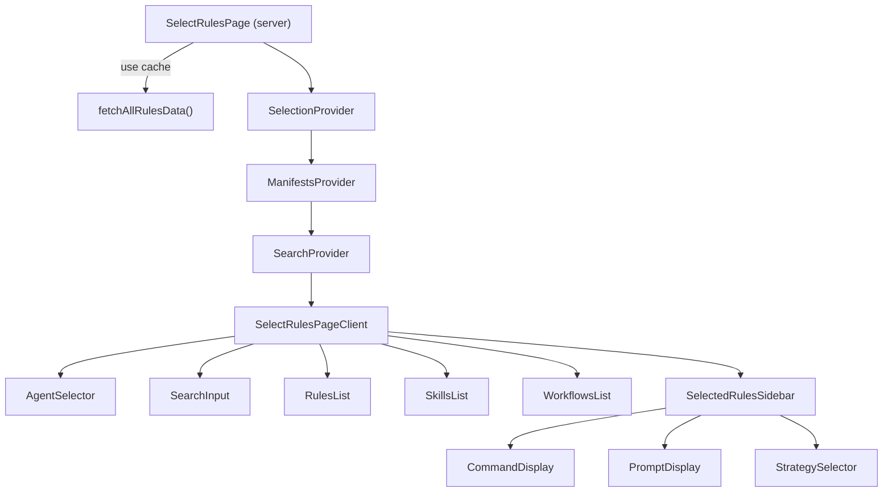

# Architecture

This document describes the system architecture, data flow, and key components.

**Related:** [Overview](./overview.md) · [Patterns](./patterns.md) · [Flows](./flows.md)

## High-Level Architecture



## Monorepo Structure

```
/src
  /app              # Next.js pages, API routes, web UI
    /api/lib         # Local fetcher, cache primer, rules-data-fetcher
    /api/rules       # GET /api/rules endpoint
    /api/health      # Health check endpoint
    /hooks           # React hook factories (createReducerContext)
    /select-rules    # Rule selection page (server + client components)
  /cli               # CLI tool
    /commands         # init, pull, add, generate-questions
    /lib              # api-client, config, files, prompts, types, ollama, questions
  /components         # React UI components (16+ files)
    /ui               # shadcn/ui primitives
  /hooks              # Custom hooks (useAgentManifests, useDisplayManifests)
  /lib                # Shared client/server logic
    search.ts          # Fuse.js search engine
    search.state.tsx   # Search context provider
    selection.state.tsx # Selection context with reducer
    manifests.state.tsx # Manifests context provider
    command-generator.ts # CLI command string builder
    prompt-generator.ts  # ChatGPT prompt builder
    metadata.ts        # SEO metadata
  /server             # Server-side utilities
    database.ts        # MongoDB connection
    rules-repository.ts # Rules CRUD
    questions-repository.ts # Questions CRUD
    workflows-repository.ts # Workflows CRUD
    types.ts           # All server/shared type definitions
    utils.ts           # Server utilities
/rules               # Rule files (antigravity, claude-code, cursor)
/skills               # Skill packages (antigravity, claude-code)
/workflows            # Workflow files (antigravity only)
/cli-package          # Published npm package workspace
/tests                # Test suites
/docs                 # ADRs, system design, manifest schema, roadmap
```

## Data Fetching Architecture

The API has evolved from a GitHub-first to a **local-filesystem-first** architecture:

### Previous: GitHub Fetcher
The old `github-fetcher.ts` called GitHub API to discover agents → categories → files, then cached in MongoDB.

### Current: Local Fetcher + Cache Primer
Three files replace the GitHub fetcher:

1. **`rules-data-fetcher.ts`** — Entry point. Checks MongoDB first; if empty, calls cache primer.
2. **`cache-primer.ts`** — Reads local filesystem via local-fetcher, stores results in MongoDB.
3. **`local-fetcher.ts`** — Reads `/rules`, `/skills`, `/workflows` directories from local disk. Discovers agents, categories, manifests, rule files, skills (with supporting files), and workflows.



## Web UI Architecture

The select-rules page uses a **server component → client component** composition:



**State Management:** Three React context providers with `useReducer`:
- **ManifestsProvider** — Stores rules data, questions, and agent list
- **SearchProvider** — Manages search query, context tokens, and filtered results
- **SelectionProvider** — Manages selected rules/skills/workflows, agent, and overwrite strategy

## Database Collections

| Collection | Document Type | Purpose |
|---|---|---|
| `rules_data` | `StoredRulesDocument` | Cached rules (per agent+category) |
| `skills_data` | `StoredSkillsDocument` | Cached skills (per agent) |
| `workflows` | `StoredWorkflowsDocument` | Cached workflows (per agent) |
| `questions` | `QuestionDocument` | Generated questions for search refinement |
