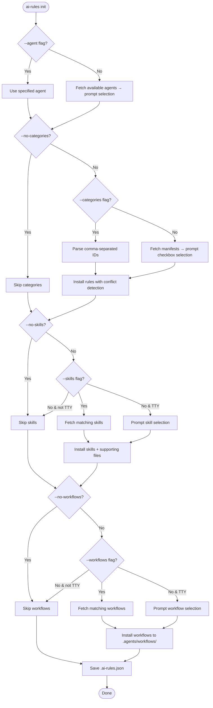
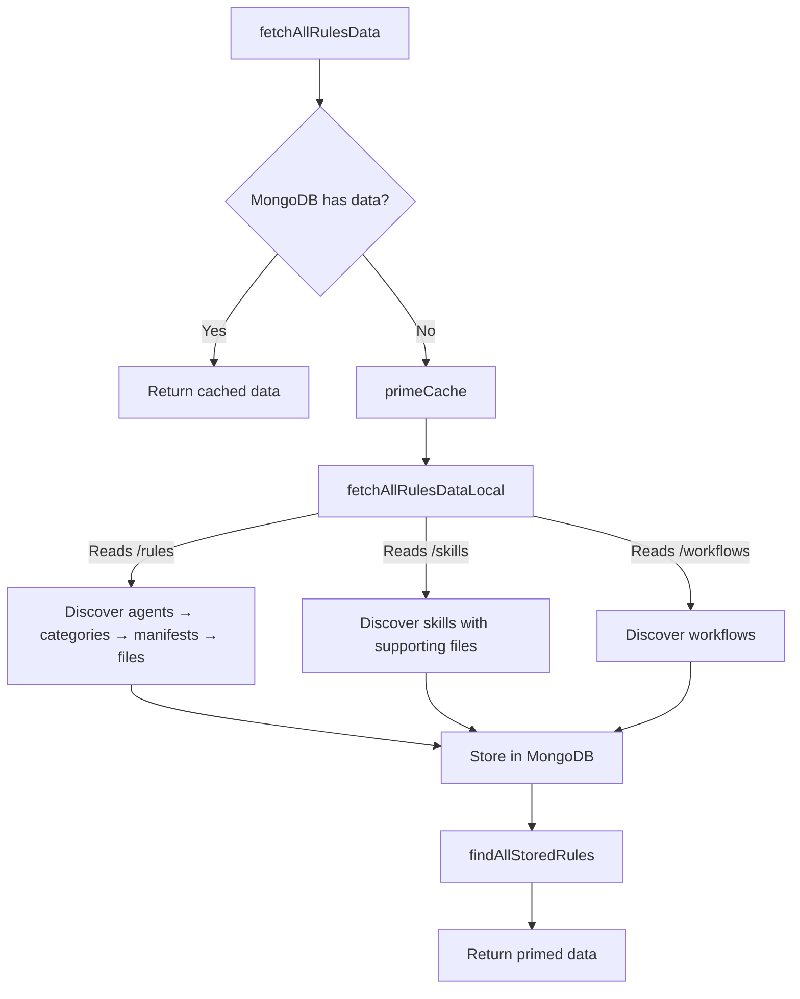
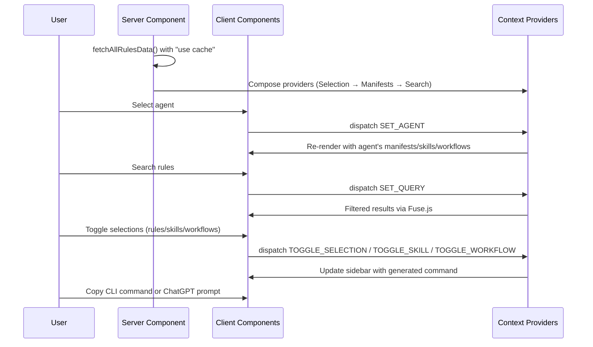
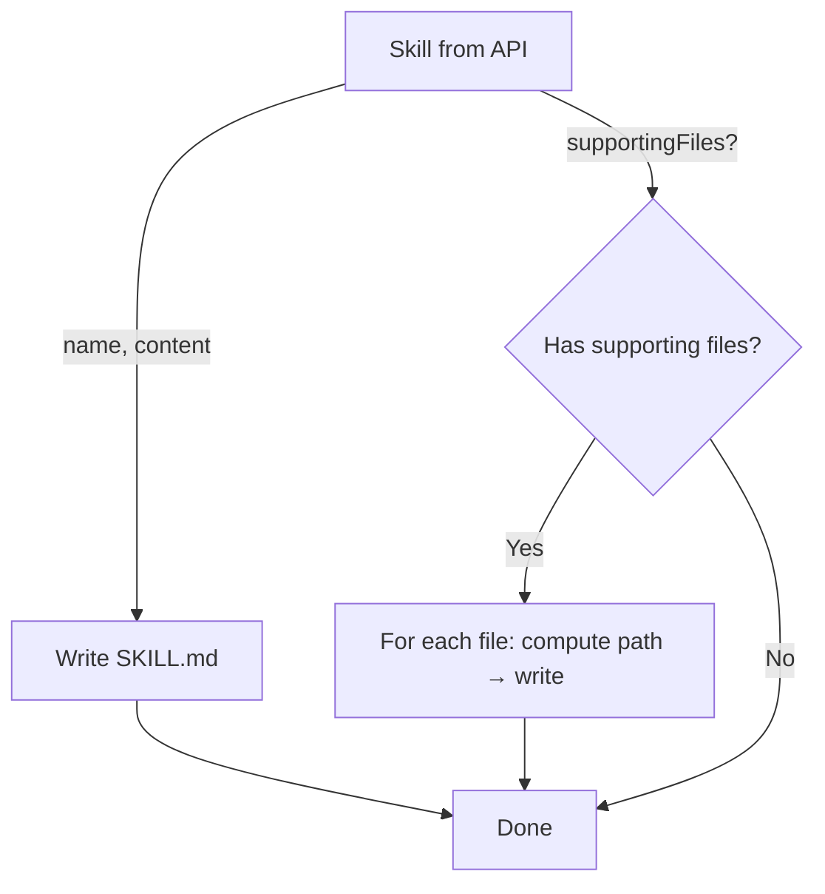

# Key Flows

This document describes the critical flows through the system.

**Related:** [Architecture](./architecture.md) · [Patterns](./patterns.md) · [Overview](./overview.md)

## CLI `init` Flow

**File:** `src/cli/commands/init.ts`

## CLI `pull` Flow

**File:** `src/cli/commands/pull.ts`

Simpler than `init` — no interactive prompts:

1. Load `.ai-rules.json` config
2. For each category: find manifest → fetch files → write with naming convention
3. For each skill: find skill → write SKILL.md + supporting files
4. For each workflow: find workflow → write to `.agents/workflows/`
5. Report results

Default overwrite strategy is `force` (overwrite all).

## CLI `add` Flow

**File:** `src/cli/commands/add.ts`

Adds content to an already-initialized project (requires existing `.ai-rules.json`):

1. Verify `.ai-rules.json` exists and has agent configured
2. Parse `--categories`, `--skills`, `--workflows` flags
3. Support `all` keyword for any content type
4. Install with conflict detection per overwrite strategy
5. Update and save config

## API Data Fetch Flow

**File:** `src/app/api/lib/rules-data-fetcher.ts`

## Local Fetcher Discovery Flow

**File:** `src/app/api/lib/local-fetcher.ts`

The local fetcher reads content from the repository's own filesystem:

1. **Discover agents:** List directories in `/rules`
2. **Per agent, discover categories:** List subdirectories in `/rules/{agent}`
3. **Per category:** Parse `manifest.json`, fetch all listed rule files in parallel
4. **Discover skills:** List subdirectories in `/skills/{agent}`, read `SKILL.md` from each, recursively collect supporting files
5. **Discover workflows:** List `.md` files in `/workflows/{agent}` (excluding README.md)

## Web UI Rule Selection Flow

## Question Generation Flow

**File:** `src/cli/commands/generate-questions.ts`

Uses local Ollama LLM to generate refinement questions:

1. Read all `manifest.json` files from rule categories
2. Build prompt with all categories' tags and descriptions
3. Call Ollama API with structured output schema (Zod v4)
4. Parse response into typed questions (yes-no, choice, open-ended)
5. Write questions to `/questions` directory as JSON

## Skills Installation with Supporting Files

Supporting files path: `applySkillFileNamingConvention(agent, skillName, relativePath)` replaces `SKILL.md` suffix with the relative path.
